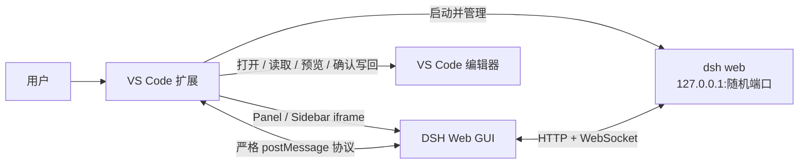

<p align="center">
  
</p>

<h1 align="center">DeepSeek Harness for VS Code</h1>

<p align="center">
  在 VS Code 中运行完整的 DeepSeek Harness Web GUI，并提供安全、显式的编辑器联动。
</p>

<p align="center">
  
  
  
  
</p>

> [!IMPORTANT]
> 本扩展仅支持桌面版 VS Code 和本地 Extension Host。Remote SSH、Dev Containers、WSL、Codespaces 与 `vscode.dev` 暂不支持。

DeepSeek Harness for VS Code 会在本机启动 [DeepSeek Harness（DSH）](https://github.com/deepseek-ai/deepseek-harness) Web 服务，并将原始 GUI 嵌入编辑器面板或活动栏侧边栏。DSH 的会话、Skills、审批和设置界面保持不变；可选 bridge 在此基础上增加打开文件、共享选区、只读 Diff 和确认后写回能力。

本项目是社区扩展，不隶属于 DeepSeek 官方。扩展不捆绑或重新分发 DSH 本体。

## 功能

| 能力 | 说明 | 状态 |
|---|---|:---:|
| 完整 DSH GUI | 在编辑器面板、活动栏侧边栏或系统浏览器中使用 DSH | ✅ |
| 本地服务管理 | 自动选端口、健康检查、异常重启、stale 实例检测和进程树清理 | ✅ |
| 多窗口复用 | 多个 VS Code 窗口共享同一个本地 DSH 实例 | ✅ |
| Open in VS Code | 从 DSH 产物行打开文件并定位到指定行列 | ✅ |
| 显式共享上下文 | 仅在用户点击时共享光标位置或有界选区，不自动读取全文 | ✅ |
| 只读 Diff | 使用内存虚拟文档在 VS Code 中预览 DSH 已产生的变更 | ✅ |
| 确认后写回 | DSH 只提交提案；VS Code 原生 Diff、模态确认和重复校验后才修改缓冲区 | ✅ |
| Headless 任务 | 在 VS Code 集成终端运行一次性 DSH 任务 | ✅ |

## 工作原理



- 服务固定绑定 `127.0.0.1`，端口由扩展预分配。
- iframe 直接加载 DSH 的 SPA、API 与 WebSocket，不修改 DSH 前后端。
- Bridge 消息经过 iframe source、精确 origin、字段结构和大小限制校验。
- 文件写回授权只发生在 VS Code 原生模态确认中，iframe 按钮本身不具备写权限。

## 环境要求

- 桌面版 VS Code `1.90.0` 或更高版本。
- 本机已安装 DSH，且 `dsh` 位于 `PATH`；也可通过 `dsh.binPath` 指向 DSH 的 `lib/bin.js`。
- Node.js 环境可供 DSH 使用。
- 如需启用 VS Code bridge，本机还需提供 `pnpm`，因为 `dsh plugin` 会调用它安装插件。

## 安装

当前版本以本地 VSIX 方式安装。

```powershell
git clone https://github.com/Mike1145141919810/deepseek-harness-vscode.git
cd deepseek-harness-vscode
npm install --prefix extension
npm run package
code --install-extension .\extension\dsh-vscode-0.2.0.vsix
```

安装后执行 `Developer: Reload Window`，然后运行 `DSH: Check Installation` 检查 DSH 是否可用。

### 启用 VS Code Bridge

Bridge 为可选组件，用于编辑器原生联动：

1. 打开命令面板，运行 `DSH: Install VS Code Bridge`。
2. 阅读原生模态确认内容，选择 **Install**；已安装时显示 **Reinstall**。
3. 安装完成后选择 **Restart DSH**。
4. 再次运行 `DSH: Check Installation`，确认输出包含 `bridge: READY`。

Bridge 已包含在 VSIX 中，不依赖源码仓库。安装命令会调用 `dsh plugin --profile web add`，并幂等更新 web profile 的 loader 配置；修改 `cordis.patch.yml` 前会保留备份。

## 快速开始

1. 在 VS Code 中打开一个本地文件夹或工作区。
2. 运行 `DSH: Open DeepSeek Harness`，或点击状态栏中的 `DSH`。
3. 在 DSH GUI 中创建会话并执行任务。
4. 如已启用 bridge，可在 DSH 中显式打开文件、共享编辑器上下文、预览 Diff 或提交写回提案。

打开位置由 `dsh.openIn` 控制：

- `panel`：编辑器区域中的 Webview Panel，默认选项。
- `sidebar`：活动栏中的 DeepSeek Harness 侧边栏。
- `browser`：使用系统默认浏览器打开同一服务。

隐藏或重新打开面板不会结束会话。DSH 异常退出时，扩展会自动重启一次并让 Webview 进入可重试的重连状态。

## 命令

| 命令面板名称 | 用途 |
|---|---|
| `DSH: Open DeepSeek Harness` | 按当前 `dsh.openIn` 设置打开 GUI |
| `DSH: Open in Browser` | 在系统默认浏览器打开当前实例 |
| `DSH: Restart Server` | 重启本地 DSH Web 服务 |
| `DSH: Stop Server` | 停止当前窗口拥有的服务，或与共享实例断开 |
| `DSH: Show Server URL` | 显示当前回环地址与端口 |
| `DSH: Check Installation` | 检查 DSH 与 bridge 安装状态 |
| `DSH: Install VS Code Bridge` | 安装或重新安装随 VSIX 提供的 bridge |
| `DSH: Run Task (headless)` | 在集成终端运行一次性 headless 任务 |

## 编辑器联动

### 打开文件

DSH 的产物文件行会显示 **Open in VS Code**。点击后，扩展使用 `showTextDocument` 打开本地文件；消息包含行列信息时会同步定位光标。

### 共享编辑器上下文

会话输入框工具行提供 **共享编辑器上下文** 按钮：

- 有选区时只共享受大小限制的选中文本。
- 无选区时只共享文件 URI、语言、版本和光标位置，不读取全文。
- 上下文只注入点击时绑定的会话，不会自动唤醒空闲会话。

### 只读 Diff

成功的文件变更会显示 **在 VS Code 中预览变更**。预览内容来自 DSH 已持久化的 `oldText` / `newText`，并通过内存虚拟文档打开 `vscode.diff`；预览过程不会读取、创建或修改目标文件。

### 确认后写回

`vscode_apply_diff` 只能生成单文件编辑提案。用户点击 **在 VS Code 中审阅并应用** 后，扩展执行以下流程：

1. 校验请求结构、摘要、工作区信任、文件类型和真实路径边界。
2. 校验编辑器未修改，且当前全文与提案 preimage 完全一致。
3. 打开只读 Diff，并显示 VS Code 原生模态确认。
4. 用户明确确认后再次执行全部安全检查。
5. 使用一个 Undo 单元替换编辑器缓冲区，但不自动保存。

首版只支持可信本地工作区内已经存在的单个普通文本文件。不支持创建、删除、移动、重命名、多文件事务、二进制文件或 Remote URI。详细门槛见 [Phase 2D 写回安全说明](./docs/phase-2d-safety.md)。

## 设置

| 设置 | 默认值 | 说明 |
|---|---:|---|
| `dsh.binPath` | `""` | DSH 的 `lib/bin.js` 或包含它的目录；空值表示从 `PATH` 自动查找 |
| `dsh.openIn` | `"panel"` | GUI 打开位置：`panel`、`sidebar` 或 `browser` |
| `dsh.allowNpxFallback` | `false` | 找不到本地 DSH 时允许通过 npx 引导；开启后可能访问网络 |
| `dsh.autoStart` | `false` | VS Code 启动时自动启动 DSH 服务 |
| `dsh.autoWorkspace` | `true` | 打开 GUI 时自动将当前 VS Code 工作区注册到 DSH |
| `dsh.extraArgs` | `[]` | 传给 DSH 的附加参数；禁止覆盖 `--host`、`--port`、`--trusted-host` |
| `dsh.pinnedVersion` | `"0.1.1-rc.2"` | npx 兜底使用的 DSH 版本 |

## 安全设计

- DSH Web 服务只能监听 `127.0.0.1`，安全相关 CLI 参数不可被设置覆盖。
- Webview CSP 只允许加载本地 nonce 脚本和回环地址 iframe。
- 双向消息使用精确 iframe source、origin、`requestId` 与 `sessionId` 关联。
- 输入执行严格字段、类型、路径和大小校验，拒绝未知字段及超限内容。
- 写回前后均检查 workspace trust、lexical/canonical path、符号链接逃逸、dirty 状态、全文 preimage 和文档版本。
- 写回请求有超时、单请求和防重放门禁；失败时不会降级为直接文件系统写入。
- 成功写回只修改编辑器缓冲区，磁盘在用户主动保存前保持不变，并可用一次 Undo 恢复。
- VS Code 关闭或重载时，扩展会结束其拥有的 DSH 进程树并验证端口释放。

## 开发与验证

```powershell
# 类型检查、构建、单元测试和真实 DSH 集成测试
npm test

# 真实 VS Code Extension Host 烟测
npm run smoke

# 生成 VSIX
npm run package
```

当前 `v0.2.0` 验证基线：

- 18 个测试文件、126 项测试通过，其中包含 2 项真实 DSH Web 集成测试。
- 9 项真实 VS Code Extension Host 烟测通过。
- 安装态真实 DSH GUI 的上下文、Diff 和写回按钮链路通过。
- VSIX 打包与本机覆盖安装通过。

完整步骤和测试记录见 [VERIFICATION.md](./VERIFICATION.md)。在仓库根目录按 `F5` 可启动 `Run Extension` 开发宿主。

## 故障排查

<details>
<summary><strong>找不到 DSH</strong></summary>

运行 `DSH: Check Installation` 查看探测链。确认 `dsh` 位于 `PATH`，或把 `dsh.binPath` 指向有效的 `lib/bin.js`。

</details>

<details>
<summary><strong>服务未能启动或面板空白</strong></summary>

在输出面板选择 `DeepSeek Harness` 通道查看子进程日志，尝试 `DSH: Restart Server`。如 Webview 仍无法加载，可暂时将 `dsh.openIn` 设为 `browser`。

</details>

<details>
<summary><strong>编辑器联动按钮未出现或无响应</strong></summary>

运行 `DSH: Check Installation`，确认结果包含 `bridge: READY`。否则执行 `DSH: Install VS Code Bridge`，重启 DSH，并在必要时运行 `Developer: Reload Window`。

</details>

<details>
<summary><strong>写回提案被拒绝</strong></summary>

确认 VS Code 工作区已受信任、目标是工作区内已存在的普通文本文件、编辑器没有未保存更改，并且文件内容自提案生成后没有变化。安全门槛不满足时扩展会保持零写入。

</details>

## 项目文档

- [实施计划与路线图](./PLAN.md)
- [架构说明](./docs/architecture.md)
- [Phase 2D 写回安全门槛](./docs/phase-2d-safety.md)
- [验证步骤与结果](./VERIFICATION.md)
- [第三方声明](./THIRD_PARTY_NOTICES.md)

## 路线图

- Phase 1：DSH GUI 嵌入、进程生命周期和多窗口复用。✅
- Phase 2A：Open in VS Code。✅
- Phase 2B：显式共享编辑器上下文。✅
- Phase 2C：只读 Diff。✅
- Phase 2D：原生确认后的安全写回。✅
- Phase 3：主题同步、设置深链、CI、Open VSX / Visual Studio Marketplace 发布。规划中。

## License

[MIT](./LICENSE) © 2026 Michael Lee

DeepSeek Harness 由其作者依照 MIT License 发布。本扩展仅启动并展示用户本机已有的 DSH，详见 [THIRD_PARTY_NOTICES.md](./THIRD_PARTY_NOTICES.md)。
